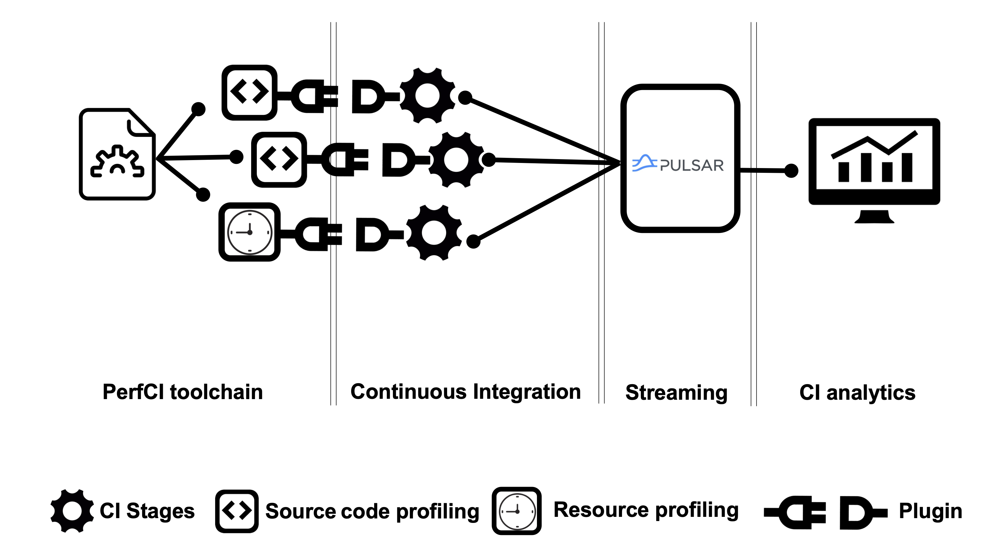

# Analytics system for Continuous Integration (CI) of Python Projects

This repository contains front-end code for analyzing Python-based projects. The front-end is developed as a part of the research work conducted for improving performance testing during DevOps practices at CERN. We provide instructions of how to deploy back-end for collecting CI data.

## Overview of our analytic system


PerfCI toolchain, Streaming which takes place in a CI process constitutes the back-end of our analytic system. On the other hand, CI analytics is the front-end.

## Setting the analytic system for CI data analysis
Ideally, the front-end and back-end can be deployed on different VMs.

### Back-end deployment
There are different steps which needs to be taken in order to deploy back-end. 

- **CI Data Streaming:** This requires setting up of Apache pulsar components such as broker. This can be found in Pulsar official [documentation](https://pulsar.apache.org/). Secondly, mongo connector that needs to be installed which can be found in the [link](https://pulsar.apache.org/download/). More information on  mongo connector can be found in the MongoDB sink connector [documentation](https://pulsar.apache.org/docs/en/io-mongo-sink/). MongoDB sink connector can be setup by doing as follows:
    - First setup mongodb container: 
    > $ docker run -d -p 27017-27019:27017-27019 --name mongodb mongo
    - Create mongo sink files. This is a yaml file e.g., mongodbcon/mongo-trace.yml
    ```  
        tenant: "public"
        namespace: "default"
        name: "mongo-sink-trace"
        configs:
            mongoUri: "mongodb://localhost:27017/admin"
            database: "ci-db"
            collection: "trace"
            batchSize: 1
            batchTimeMs: 1000
    ```
    
    - Create the connector
     ```
     $ bin/pulsar-admin sink create --sink-type mongo --sink-config-file mongodbcon/mongo-trace.yml --inputs TRACE_TOPIC 
     ```

    - Test to check whether sink connector functions properly
    ```
     $ bin/pulsar-client produce -m "{'test:' 'trace'}" TRACE_TOPIC
    ```
    - Check whether the message is in the mongodb database
    ```
    $ docker exec -it mongodb mongo
    ```

    ```
    $ use ci-db
    ```

    ```
    $ db.trace.find()
    ```

    - There will be a record in the collection trace.

- **CI analysis:**  back-end of the analytic system takes analysis data from CI process via PerfCI plugin. More information about PerfCI and how it can be setup with your Python-project can be found in the [article](https://ieeexplore.ieee.org/document/9286019) and the code is available on [GitHub](https://github.com/JesperStromblad/perfci).

 > Example code for profiling program resource e.g., execution time and memory utilization can be found in the [code](https://github.com/JesperStromblad/perfci/blob/main/plugins/resourcecollector.py)

> More complex profiling such as measuring code metrics can be found in [tracer plugin](https://github.com/JesperStromblad/perfci/blob/main/plugins/tracer.py)

- After completion of CI process for a specific commit (i.e., code update). Our CI dashboard can be used to analyze our CI analysis.

### Front-end deployment

The front-end dashboard is executed by running the following python script.
> python3 app.py


